# A DIY hot water cylinder monitor for Home Assistant

Input energy to an electric water heater is easy to log in Home Assistant. The energy that leaves in the hot water is not. Neither is how much usable heat remains in the tank.

This build estimates both with a heat meter on the pipes and an energy balance on the tank.

The recipe below is one working installation: an ESP32, a water flow meter, a temperature sensor, an input energy sensor, and two Node-RED subflows. I run this on two tanks; the YAML uses generic names.


*86.7 % of a tank left. The box is the easy part — this article is about where that number comes from. The second display and the green button are a bonus; they come back at the end.*

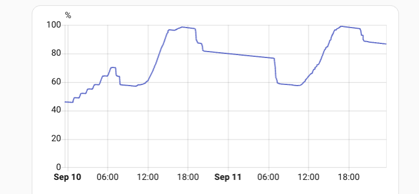

*The same number over two days. The steps down are showers, morning and evening. The stepped climb through the first night is the heater on the cheap night tariff; the long smooth climbs after midday are solar. The gentle sag through the second night, with no heating at all, is standby heat loss.*

---

## The idea

The model keeps one running account from three terms:

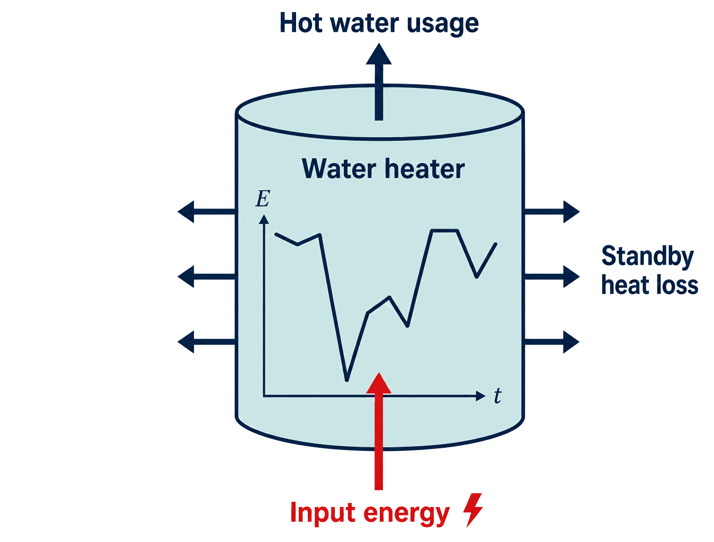

- **Input energy** — electrical energy into the water heater. One `total_increasing` sensor in kWh. I built that from three Shelly Pro 2PMs (one per heating element / phase). The model does not care how you build that sensor.
- **Hot water usage** — thermal energy carried out in the drawn water, relative to the cold water that replaced it: $E = m\\,c\\,\Delta T$.
- **Standby heat loss** — energy the tank loses to the room, modelled as a power that scales with how full it is.

The running total is **energy deficit**: how far the water heater is below a defined full, in kWh. `0` is that full; more negative means more heat has left than has been put back. It is clamped so it cannot go above `0`.

Counting down from full rather than up from empty is the point. Full announces itself: the heating stops, the tank really is full, and the account can be pushed back to `0` and held there. Empty announces nothing. It is hard to even define, and in a house that keeps washing it is a state you would almost never reach. So the account is anchored at the end that tells you when you have arrived, and the clamp at `0` does the correcting.

**Charge** is that account as a percentage of **estimated full energy**.

$$
\text{charge} = 100\\% + 100 \times \frac{\text{energy deficit}}{\text{estimated full energy}}
$$

If estimated full energy is 21 kWh, then 0.21 kWh is one percent, so charge is `100 + deficit / 0.21`. The kWh account is the measured half of that; the percentage is guesswork laid on top, because estimated full energy is a guess. Heat in the tank is layered (stratification); I will call that **heat distribution**. Charge can go below 0 % while the tap is still hot. That is expected: estimated full energy is chosen on the safe side, and heat distribution means the last useful water is not a sharp empty.

---

## Hardware

I had an electrician do the mains and a plumber do the tank connections.

### Parts (this build)

| Part | Role |
|------|------|
| Olimex ESP32-PoE | ESPHome, Ethernet |
| ScioSense UFM-01 | Accumulated flow (L) + **cold temperature** |
| DS18B20 | **Hot temperature** (pipe surface) |
| 10 µF on UFM 5 V–GND | Supply bypass |
| 10 kΩ + 30 kΩ | UART 5 V → 3.3 V divider on ESP32 RX |
| 5.1 kΩ | Dallas pull-up to 3.3 V |
| Energy sensor, increasing, in kWh | **Input energy** (I used three Shelly Pro 2PM) |

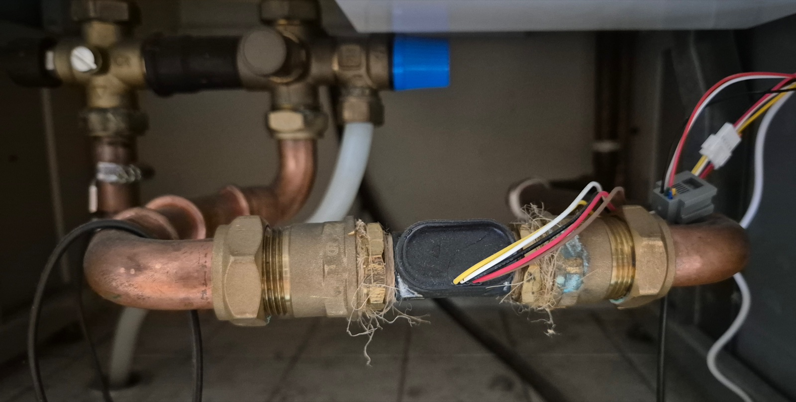

*The UFM-01 — the black oval — inline on the cold inlet between two compression fittings. The mixer is the brass and black assembly at the top left, so the meter sits upstream of it on the common cold supply.*

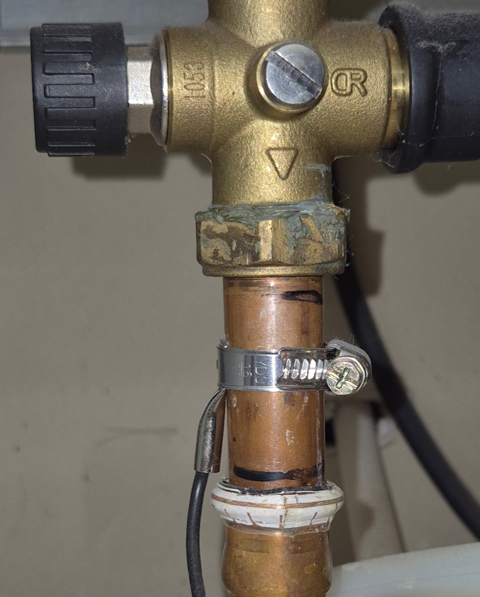

*The DS18B20 clamped against the hot pipe just below the mixer. A sensor inside the pipe would read faster and truer; this is what I have.*

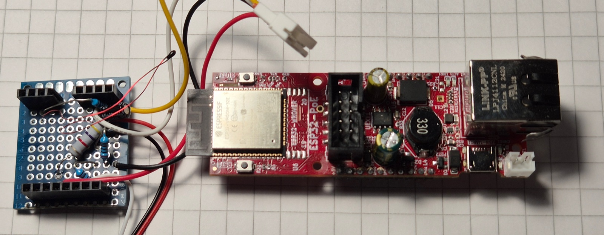

*Where the passives live: the UART divider and the Dallas pull-up on a scrap of perfboard, wired out beside the ESP32-PoE, before any of it went into an enclosure. The silkscreen reads plain `ESP32-PoE` — the ISO variant is pin-identical if that is what you have.*

### Plumbing

**Treat the water heater and the mixer under it as one appliance.** Cold water goes in at one end, hot water comes out at the other, and everything in between — the tank, the mixer, the pipes joining them — is inside that appliance. Measure where the water crosses the outer edge: flow and cold temperature on the pipe going in, hot temperature on the pipe coming out. A sensor placed inside only sees part of the water.

```text
                        ┌──────────┐
cold supply ──UFM──┬────┤   tank   ├──hot───┐
                   │    └──────────┘        │
                   │                   ┌────┴────┐
                   └───── cold ────────┤  mixer  ├──Dallas── taps
                                       └─────────┘
```

The rule is that **the UFM must see every litre that later passes the Dallas**. Get that right and the mixer stops mattering: blending does not destroy energy, it trades a smaller volume of hotter water for a larger volume of cooler water, and $V \cdot \Delta T$ comes out the same. Measuring on the house side of the mixer still measures what left the tank.

So put the UFM **upstream of the tee that feeds the mixer's cold port**, on the common cold supply, as in the sketch. Every litre through it is then a litre out of the taps. Put it downstream instead, on the branch that only feeds the tank, and the cold going straight to the mixer bypasses it — you are metering tank throughput, and the account under-debits by however much cold the mixer blends in. That is not a rare case; blending is what the mixer is for.

- The UFM measures flow *and* temperature. Here that temperature is $T_\text{cold}$. The module is rated to 60 °C. Both pipes may stay under that, and the volume change from heat is small, so the hot pipe would work. I still put it on the cold side. You can swap: UFM on the hot pipe ($T_\text{hot}$) and the Dallas on the cold pipe ($T_\text{cold}$).
- A sensor *inside* the pipe would be better than a pipe-surface DS18B20. I tried wrapping the sensor; I am not sure it helps.
- Mount the UFM with the flow arrow pointing in the direction of the water.

Not every tank has a mixer under it. Then there is only a cold inlet and a hot outlet. Put the UFM on the cold inlet and the Dallas on the hot outlet, both close to the tank. Without a mixer, there is no before or after.

### UART and Dallas (ESP32-PoE)

UFM-01 is 5 V, UART **2400 8E1**. The ESP32 is 3.3 V.

- UFM 5 V and GND. 10 µF across 5 V–GND.
- GPIO32 (TX) → UFM RX.
- UFM TX → 10 kΩ → GPIO35 (RX) → 30 kΩ → GND. GPIO35 is input-only, which is why it is RX.
- DS18B20: 3.3 V, GND, data on GPIO16, 5.1 kΩ to 3.3 V.

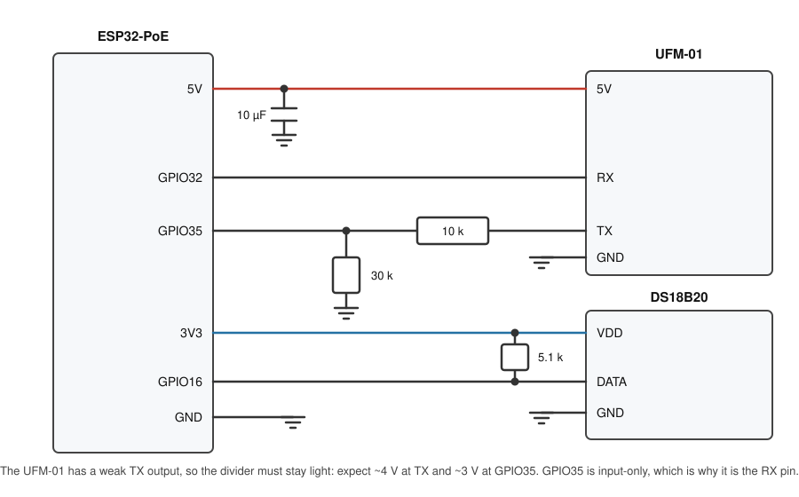

*The circuit. The divider is the only part that needs care, and the values matter more than they look: the 10 kΩ goes in series from the UFM's TX, the 30 kΩ from GPIO35 to ground. Wire those two the other way round and the pin sees far more than it should.*

**Why 10 kΩ and 30 kΩ and not something smaller.** The UFM-01's TX is a weak output. It reaches its full 5 V with nothing attached, but it sags badly as soon as you draw current — on both of my meters it measured about 2.9 kΩ of effective source impedance. A 1 kΩ / 2 kΩ divider presents 3 kΩ to that, which throws away half the signal before it starts: I measured 2.4 V at the TX pin and 1.6 V at the ESP, below the level the ESP32 is guaranteed to read as a high. One meter failed outright and the other silently dropped about a quarter of its frames. At 10 kΩ / 30 kΩ the load is thirteen times lighter, and the same two meters give 3.7–4.1 V at TX and 2.8–3.1 V at the pin, comfortably in spec. There is no speed cost: at 2400 baud a bit lasts 416 µs and this network settles in under a microsecond.

**Worth checking once, when you build it.** With the divider fitted and the meter idle, measure the UFM's TX pin against ground. Three quarters of whatever you read is what the ESP sees. Above about 2.5 V is fine; much below that and it will be unreliable in a way that looks like a flaky meter rather than a wiring problem — increase both resistors, keeping the 1:3 ratio.

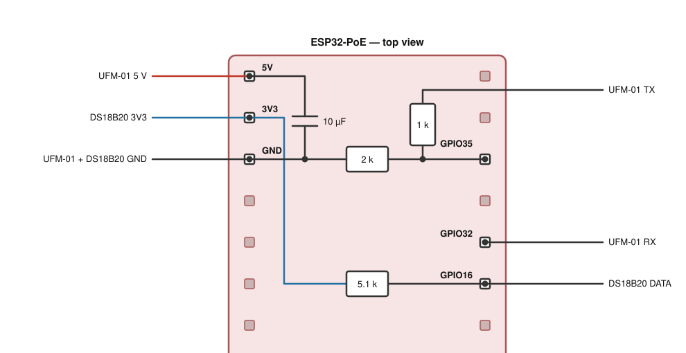

*One way to lay it out. GND and GPIO35 sit level with each other, so the divider becomes a straight run: ground wire, 30 kΩ, junction, GPIO35 — with the 10 kΩ branching up from that junction into the UFM's TX wire. The 10 µF bridges 5 V and GND, and the 5.1 kΩ goes from 3V3 to GPIO16. Power and ground leave one side, the three signals the other. Only the pins used are labelled, and both headers carry on below the frame.*

Same idea on any other board; only the GPIO numbers change. Check yours before wiring, though — the variants differ, and on the ESP32-PoE-WROVER, GPIO16 is taken by the module itself and never reaches the header. Any free bidirectional pin will do for the Dallas instead, GPIO13 say; just not GPIO34–39, which are input-only and cannot drive a one-wire bus.

---

## ESPHome

The [`ufm01`](https://esphome.io/components/ufm01/) component ships with ESPHome, so there is nothing external to add — but you want **2026.8.1 or newer**, which is what I run. Older releases are missing the startup reset retry that gets the meter talking again after a reboot.

The whole config is [`water-heater.yaml`](config/water-heater.yaml) — self-contained, no packages, generic names. Pins are for the ESP32-PoE, and the other boards in that family share the pinout, so the same `esp32-poe` board id covers them. Set an OTA password and API encryption before the device is on the network.

Most of that file is boilerplate: board, Ethernet, `logger`, `api`, `ota`. This is the part that carries the design.

```yaml
# UFM-01: 5 V + GND, 10 µF across 5 V–GND.
# ESP32 TX (GPIO32) → UFM RX.
# UFM TX → 10 kΩ → ESP32 RX (GPIO35) → 30 kΩ → GND (divider).
# UART: 2400 8E1.
uart:
  - id: uart_bus
    tx_pin: GPIO32
    rx_pin: GPIO35
    baud_rate: 2400
    parity: EVEN
    stop_bits: 1

ufm01:
  id: ufm01_component
  uart_id: uart_bus

# DS18B20: 3.3 V + GND, data GPIO16, 5.1 kΩ pull-up to 3.3 V.
one_wire:
  - platform: gpio
    pin: GPIO16
    id: bus1

sensor:
  - platform: dallas_temp
    name: Hot temperature
    update_interval: 2s # a second or two; fast enough to follow a draw
    one_wire_id: bus1

  - platform: ufm01
    ufm01_id: ufm01_component
    accumulated_flow:
      name: Accumulated flow
    flow:
      name: Flow
    temperature:
      name: Cold temperature
```

The file also declares the four `ufm01` diagnostic binary sensors — `ufc_chip_error`, `flow_direction_wrong`, `empty_tube` and `flow_rate_out_of_range` — as `entity_category: diagnostic`.

These are the Home Assistant entities the subflows need:

- `sensor.water_heater_accumulated_flow` (L)
- `sensor.water_heater_cold_temperature`
- `sensor.water_heater_hot_temperature`
- `sensor.water_heater_input_energy` — input energy, increasing, in kWh; name it however you like and point the subflow at it

`flow_direction_wrong` and `empty_tube` are worth a glance the first week.

If flow ever goes unavailable while `empty_tube` is *not* set, the meter has stopped talking rather than run dry. It has not been a problem for me, but it is easy to automate if it bothers you: watch for flow being unavailable for a minute or so, then power-cycle the meter — cut its 5 V if it is on a switched supply, or restart the ESP if, like the PoE board, there is nothing to switch. While the meter is quiet nothing is debited, so charge will read a little high until it comes back.

---

## The model in Node-RED

You need the Home Assistant WebSocket nodes (`node-red-contrib-home-assistant-websocket`). Import [`hot-water-usage.json`](config/hot-water-usage.json) and [`energy-balance.json`](config/energy-balance.json). After import, set the Home Assistant server on the HA nodes inside each subflow, then set the env vars below.

Energy balance keeps the account in a context store named `store`, so that it survives a restart of Node-RED. Stock Node-RED has no such store — context is in memory only — so add one to `settings.js` before you import, and restart:

```js
contextStorage: {
    store: { module: "localfilesystem" },
    default: { module: "memory" },
},
```

The name matters. Stock `settings.js` has a commented-out example, but uncommenting it gives you a *default* file store and still nothing called `store`, and the subflow will have nowhere to keep the account. The variable is called `waterEnergy`. Once the store exists, the context sidebar in the editor will show you its value. To *change* it, wire an inject node into a change node that sets that context property — you will want that once during calibration.

The JSON files are the two subflows only. You still wire them on the flow:

1. Add **Hot water usage** (it listens to accumulated flow; no input wire).
2. Wire its output into **Energy balance** (the usage debit). Energy balance also listens to input energy by entity id; no wire for that.
3. Wire Energy balance into an `ha-sensor`: `sensor.water_heater_energy_deficit` (in kWh, ≤ 0 in operation).
4. Add a change node: `100 + 100 * payload / estimatedFullEnergy`.
5. Add an `ha-sensor`: `sensor.water_heater_charge` (%).

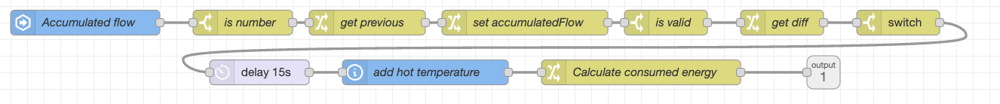

*Hot water usage, inside. Accumulated flow arrives at the left, the volume delta is taken, only increases get past the switch, then the delay, then hot temperature is fetched and the debit worked out. A couple of node labels in my live flow are older than the ones in the attached JSON; the wiring is the same.*

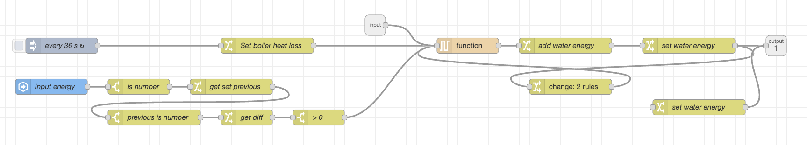

*Energy balance, inside. The 36 s timer drives standby loss along the top; input energy comes in at the left and only positive deltas pass; the usage debit arrives on the subflow input. The function node is the queue that stops the three racing each other, and **add water energy** is the node holding the 0-clamp — the one Calibration asks you to edit.*

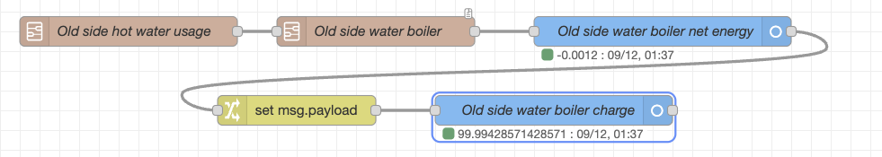

*The parent flow — the part you wire yourself. My nodes are named after the tank; in this article's terms they read Hot water usage → Energy balance → the energy deficit sensor, then a change node that turns deficit into a percentage and a second sensor for charge.*

```text
Hot water usage  ──►  Energy balance  ──►  energy deficit  ──►  charge %
                          ▲
     input energy ────────┘
     (entity id on Energy balance)
```

### Hot water usage

On each increase of accumulated flow (litres ≈ kg):

1. Take the increase in volume.
2. Wait. The Dallas is on the pipe surface, so the water that just moved has not reached it yet. **On my pipes that wait is 15 s.** Plot flow against hot temperature after a draw and read the lag. Yours will differ.
3. Read hot temperature (current) and cold temperature (already captured at the flow event).
4. Emit a **debit** (negative energy):

$$
\Delta E = -\\,k \cdot V \cdot 4184 \cdot (T_\text{hot} - T_\text{cold}) / 3.6\times 10^{6}
\quad\text{[energy in kWh if } V \text{ in litres]}
$$

$4184\\,\mathrm{J/(kg\cdot K)}$ is $c$ for water. $k$ is **usage correction** (start at `1.0`, then see Calibration).

JSONata in the subflow (payload = litres this draw):

```text
$specificHeatCapacity := 4184;
$correction := usageCorrectionCoef;
$diffT := hotTemperature - coldTemperature;
$eInJ := payload * $specificHeatCapacity * $diffT;
$eInKWh := $eInJ / 1000 / 3600;
- $eInKWh * $correction
```

| Env | What |
|-----|------|
| `accumulatedFlowId` | `sensor.water_heater_accumulated_flow` |
| `coldTempId` | `sensor.water_heater_cold_temperature` |
| `hotTempId` | `sensor.water_heater_hot_temperature` |
| `usageCorrectionCoef` | `1.0` until calibrated |

The delay node is 15 s in the JSON I attached. Change it after you look at your graph.

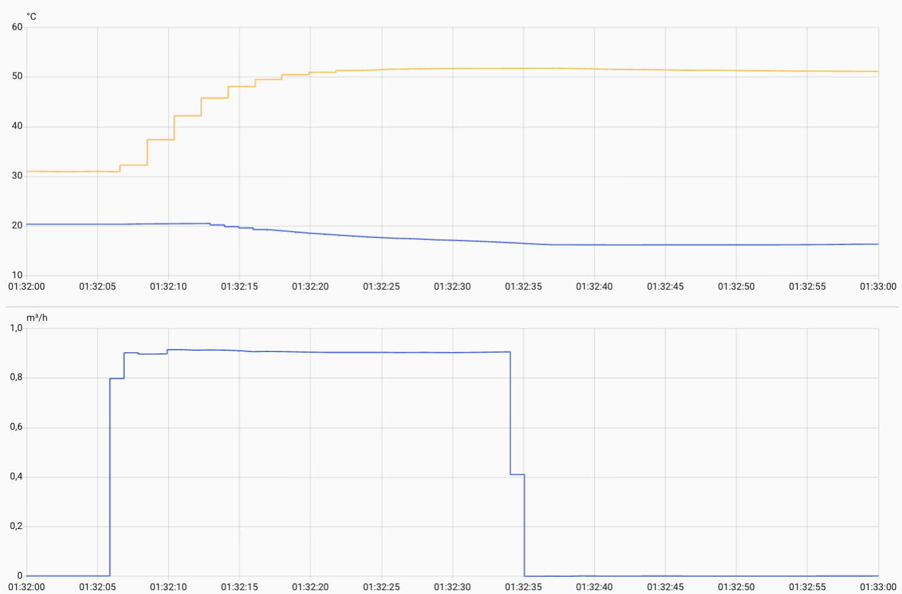

*One draw, one minute. Flow starts at :05 and stops at :34. The hot pipe begins at 31 °C — water that had been standing in it — and does not reach the tank's real 51 °C until about :20, fifteen seconds after the water started moving. That fifteen seconds is what the delay node waits out. The cold line sags over the same stretch as mains water arrives and pushes out the water that had warmed up in the inlet. Plot this on your own pipes and read your own number off it.*

Only increases count, which is what makes restarts safe. If the meter or Node-RED restarts and accumulated flow goes back to zero, that arrives as a single negative step, it is dropped, and counting resumes from the new value. You lose at most the water drawn while it was away.

### Energy balance

Three credits and debits go into one flow variable. In the JSON that variable is named `waterEnergy`; it **is** energy deficit:

**Input energy.** On each increase of the input-energy sensor, add the delta (only if > 0).

**Standby heat loss.** Every 36 s. `lossPower` is in **W**, same as the env var:

$$
\Delta E_\text{loss} = -\frac{E_\text{full} + E_\text{deficit}}{E_\text{full}} \cdot \frac{P_\text{loss}}{1000} \cdot \frac{36}{3600}
\quad\text{[kWh]}
$$

At full ($E_\text{deficit} = 0$) the tank loses at $P_\text{loss}$ watts. At “empty” ($E_\text{deficit} = -E_\text{full}$) the loss is 0. Loss scales with charge.

**Clamp (after calibration).** The new deficit is `min(0, previous + delta)`. It cannot go above 0 (full). A slight surplus over many days is deliberate, so the account would creep above 0. When the tank actually fills, the clamp pins it at 0. That pin is the calibration.

The attached `energy-balance.json` has the clamp **on**. For calibration, in the **add water energy** node, use `previous + delta` only. Put `$min([0, …])` back when you are done.

A small queue in the subflow applies loss, input, and usage one at a time so they do not race.

| Env | What | I run |
|-----|------|-------|
| `inputEnergyId` | increasing energy sensor, in kWh | (Shelly sum) |
| `estimatedFullEnergy` | energy at 100 % charge, in kWh | `21` (also used `20`) |
| `lossPower` | W at full | `120`–`125` |

Charge (step 4 above), with `estimatedFullEnergy` = 21 kWh:

```text
100 + 100 * payload / estimatedFullEnergy
```

- `sensor.water_heater_energy_deficit` — in kWh, state class measurement. It rarely sits at exactly 0. Do not add it to the Energy dashboard; input energy is already there.
- `sensor.water_heater_charge` — %, device class battery is fine. It can read negative, and a gauge card takes that in its stride: the needle sits at the bottom and the number still reads true.

---

## Calibration

Four knobs. They all change the same account. Tune in this order.

### 1. Estimated full energy

Naive whole-tank figure:

$$
E_\text{full,naive} = V_\text{tank}\cdot c\cdot\Delta T / 3.6\times 10^{6}
$$

A 300 L tank and a 60 K rise is about 21 kWh. I first used **24 kWh**, then **21 kWh** and **20 kWh** to be on the safe side. Lower means charge hits 0 % while there is still usable hot water. I have **vertical** tanks; a **horizontal** one needs a lower estimated full energy, because heat distribution is different.

### 2. Standby heat loss

An unused night is a start if you are in a hurry, but it is not enough. Leave the tank unused for **a few days** and let it do several **loss–reheat cycles** with no draws. Near full, energy deficit should drop at about $P_\text{loss}$ watts. When the heater is on, it should climb towards 0.

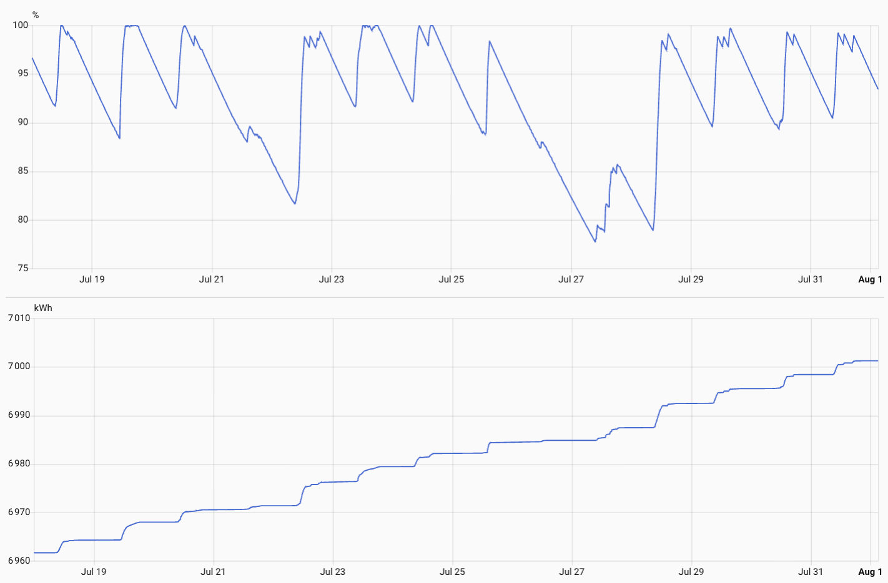

*Two weeks with the house mostly unused. Above is charge: the long smooth declines are standby heat loss with no draws at all, and every sharp rise is the heater. Below is input energy over the same fortnight — each step up lines up with a climb above. This is the shape to tune `lossPower` against, and it is why one unused night is not enough: you want several of these cycles in a row.*

### 3. Usage correction

After a known draw, does charge drop in line with the hot water you actually used? Start $k = 1$, then raise it if the formula is under-debiting. I started too high (**1.2**) and walked down to about **1.05–1.10**.

**Leave the 0-clamp off** until this is done so you can see overshoot. If the account runs away during that period, reset it to 0 by hand once — inject into a change node that sets `waterEnergy`, as above. Then turn the clamp on.

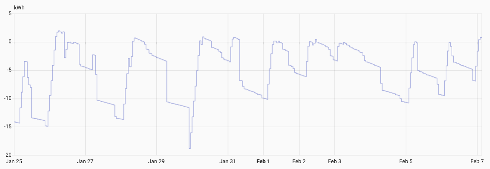

*Commissioning, with the clamp off, so the account was free to run above 0. The peaks poking above the line are the surplus you are looking for: the balance is biased slightly positive, which is exactly what you want, because once the clamp is on every real fill pins it back to 0.*

### 4. Long-run test

Over days the account should tend to creep above 0, so that real fills pin it at 0. If it never reaches 0, you are debiting too much (loss or $k$ too high). If it sits on 0 while the top of the tank is still cold, you are crediting too much.

Heating stopping does **not** mean energy deficit is 0 this cycle. That is heat distribution. The clamp may not hit 0 every heat-up. That is normal.

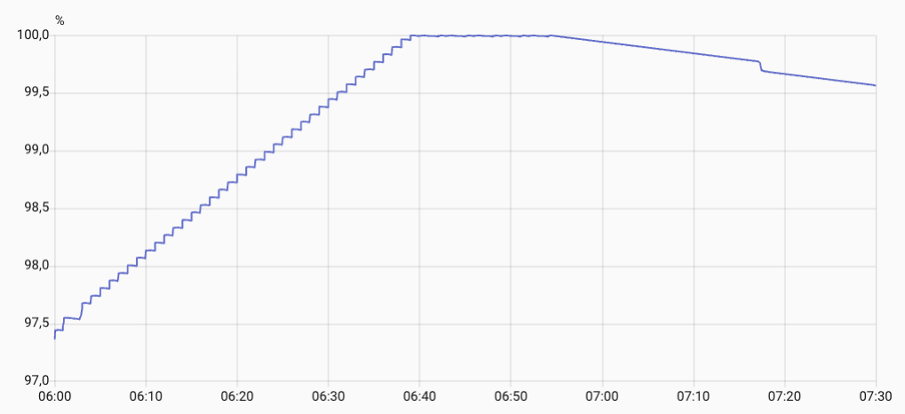

*A real fill with the clamp on. Charge climbs in steps while the heater runs, flattens dead on 100 % — that flat top is the clamp holding the account at full — and then starts its slow sag as standby loss takes over again.*

---

## What I learned

I had a working prototype in November 2024 and both production tanks from the end of January 2025. That is about eighteen months on two tanks as of writing.

**How accurate is it?** I have never put a number on it, and I am not sure one would mean much — it depends almost entirely on how carefully you calibrated. What I can say is this. In summer, sunny but never quite sunny enough, the tank can go weeks without once reaching full: weeks with no chance for the clamp to correct anything. When it finally does fill, the account is overshooting by only a little. That is the test I trust.

I do not correct the account by hand in normal operation. I did that while commissioning and when something was broken. In operation the 0-clamp *is* the calibration, because the balance is a little on the positive side.

**The bottom of the scale depends on how you got there.** That is the tank, not the meter. Come down from full in one go — a bath, or showers back to back — and there is little mixing, especially in a vertical tank: the top stays hot, and you will still be drawing hot water well below 0 %. Drift down slowly instead, with no heating for a long time, and the whole tank cools together; you can be sitting at 20 % with water that is already disappointing. Same number, different water. Nothing here can fix that, and it is worth knowing before you trust that last stretch. Charge below 0 % has happened a handful of times here in eighteen months: rare, but not theoretical.

The config linked above is for the Ethernet board (ESP32-PoE). The same sensors ran on a D1 mini first, and I also run one tank on an ESP32-C6 (Thread). The UART divider and Dallas pull-up stay; GPIOs change.

**Shower counter (application, not required).** Hot water usage is already an energy debit. Accumulating `−payload` into a counter made draws visible. That got my kids to use a lot less water. Add that node on the output of Hot water usage if you want it; it is not part of the heat meter.

That is the box at the top of this article: a D1 mini, one eight-digit MAX7219 display and a push button in a wooden case, reading two Home Assistant sensors. The left half is charge, the right half is the counter, and the green button resets the counter — one press before you get in the shower. [`charge-display.yaml`](config/charge-display.yaml) is that config. The button only reports the press; an automation in Home Assistant does the zeroing.

---

## The newer UFM-02

ScioSense now sell a **UFM-02**, and for a new installation I would probably pick it over the UFM-01. That is a recommendation from the datasheet, not from use — I have not had one in my hands.

What looks better. It comes in four sizes, G3/8″ to G1½″, where the UFM-01 is ½″ only, so you can match the meter to the pipe rather than the other way round. It resolves flow down to 0.03 l/min, against the UFM-01's 10 l/h floor. It publishes a water temperature accuracy of ±1 °C where the UFM-01 publishes none — which matters here, because that temperature goes straight into the energy sum. It is NSF61 certified for drinking water. And it draws 50 µA against the UFM-01's 2 mA, which is transformative on a battery and irrelevant on mains.

What is not better. The water temperature limit is still **0–60 °C**, so it does not let you move the meter to the hot side. Flow accuracy is much the same: about 5 % at higher flows, 10 % at low ones.

**The catch is the interface.** The UFM-01 speaks UART; the UFM-02 does not speak it at all. It offers a 4-wire pulse output or a 10-wire SPI interface, so the `ufm01` component cannot drive it — this is not a dialect difference, it is a different conversation. As of writing there is no ESPHome component for the UFM-02.

That is a smaller obstacle than it sounds, because **the pulse output needs no component at all.** It is an ordinary pulse train — 200 pulses per litre on the ½″ size — and ESPHome's built-in `pulse_meter` turns that into both a running total and a flow rate. The outputs are open-drain and rated to 60 V, so you pull one up to 3.3 V and wire it straight to a GPIO: no UART, no 5 V logic, and no divider. Given how much of the trouble in this article lives in that divider, that may be the best argument for the UFM-02 of all.

What you give up on the pulse cable is the temperature — it carries flow only — and that is a real loss rather than a swap. The UFM measures the water itself, from inside the pipe. Replacing it with a DS18B20 clamped to the outside of the cold pipe is the same compromise this article already grumbles about on the hot side: a sensor inside the pipe reads faster and truer. So the pulse route buys simpler wiring at the price of a worse cold-temperature reading. The SPI cable carries volume, flow rate and temperature together and keeps it, but someone has to write that component first.

The datasheet is still marked *Product Preview*, so check the numbers before you commit to them.

---

## Files

| File | What |
|------|------|
| [`water-heater.yaml`](config/water-heater.yaml) | ESPHome, ESP32-PoE |
| [`hot-water-usage.json`](config/hot-water-usage.json) | Node-RED subflow |
| [`energy-balance.json`](config/energy-balance.json) | Node-RED subflow |
| [`charge-display.yaml`](config/charge-display.yaml) | ESPHome, optional counter display (not part of the heat meter) |

---

*A note on names, since everyone uses a different one. I call mine a boiler. Elsewhere the same object is a hot water cylinder, a hot water tank, a hot water heater, a calorifier, a DHW tank, or just the immersion. I have used **water heater** throughout so that one word means one thing.*
