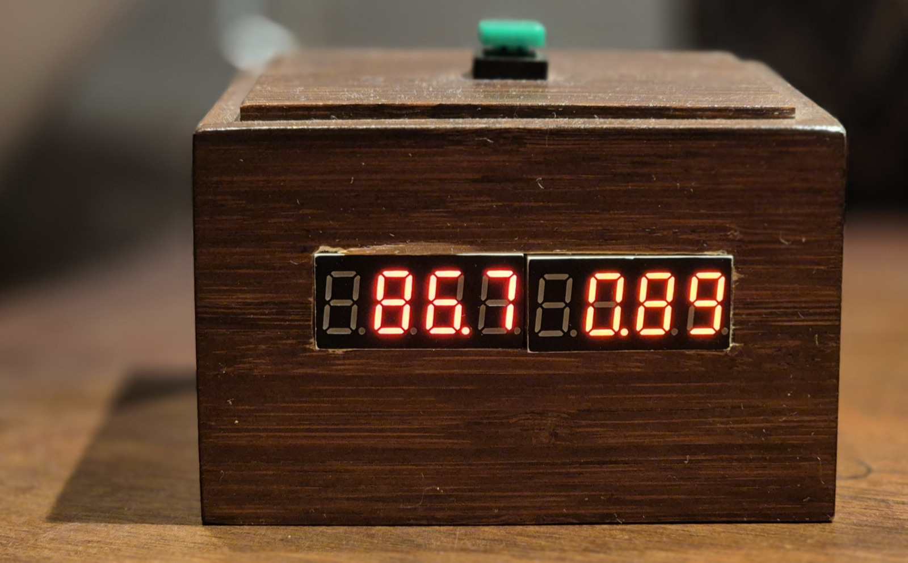

# A DIY hot water cylinder monitor for Home Assistant

Input energy to an electric water heater is easy to log in Home Assistant. The energy that leaves in the hot water is not. Neither is how much usable heat remains in the tank.

This build estimates both with a heat meter on the pipes and an energy balance on the tank.

The recipe below is one working installation: an ESP32, a water flow meter, a temperature sensor, an input energy sensor, and two Node-RED subflows. I run this on two tanks; the YAML uses generic names.

This YAML uses ESPHome’s stock [`ufm01`](https://esphome.io/components/ufm01/) component.



*86.7 % of a tank left. The box is the easy part — this article is about where that number comes from. The second display and the green button are a bonus; they come back at the end.*


*The same number over two days. The steps down are showers, morning and evening. The stepped climb through the first night is the heater on the cheap night tariff; the long smooth climbs after midday are solar. The gentle sag through the second night, with no heating at all, is standby heat loss.*

---

## The idea

The model keeps one running account from three terms:


- **Input energy** — electrical energy into the water heater. One `total_increasing` sensor in kWh. I built that from three Shelly Pro 2PMs (one per heating element / phase). The model does not care how you build that sensor.
- **Hot water usage** — thermal energy carried out in the drawn water, relative to the cold water that replaced it: \(E = m\,c\,\Delta T\).
- **Standby heat loss** — energy the tank loses to the room, modelled as a power that scales with how full it is.

The running total is **energy deficit**: how far the water heater is below a defined full, in kWh. `0` is that full; more negative means more heat has left than has been put back. It is clamped so it cannot go above `0`.

Counting down from full rather than up from empty is the point. Full announces itself: the heating stops, the tank really is full, and the account can be pushed back to `0` and held there. Empty announces nothing. It is hard to even define, and in a house that keeps washing it is a state you would almost never reach. So the account is anchored at the end that tells you when you have arrived, and the clamp at `0` does the correcting.

**Charge** is that account as a percentage of **estimated full energy**.

\[
\text{charge} = 100\% + 100 \times \frac{\text{energy deficit}}{\text{estimated full energy}}
\]

If estimated full energy is 21 kWh, then 0.21 kWh is one percent, so charge is `100 + deficit / 0.21`. The kWh account is the measured half of that; the percentage is guesswork laid on top, because estimated full energy is a guess. Heat in the tank is layered (stratification); I will call that **heat distribution**. Charge can go below 0 % while the tap is still hot. That is expected: estimated full energy is chosen on the safe side, and heat distribution means the last useful water is not a sharp empty.

---

## Hardware

I had an electrician do the mains and a plumber do the tank connections.

### Parts (this build)

| Part | Role |
|------|------|
| Olimex ESP32-POE-ISO | ESPHome, Ethernet |
| ScioSense UFM-01 | Accumulated flow (L) + **cold temperature** |
| DS18B20 | **Hot temperature** (pipe surface) |
| 10 µF on UFM 5 V–GND | Supply bypass |
| 1 kΩ + 2 kΩ | UART 5 V → 3.3 V divider on ESP32 RX |
| 5.1 kΩ | Dallas pull-up to 3.3 V |
| Energy sensor, increasing, in kWh | **Input energy** (I used three Shelly Pro 2PM) |

*[Photo: UFM-01 on the cold inlet, flow arrow visible.]*

*[Photo: DS18B20 on the usage-side hot pipe, close to the tank; mixer under the tank in the same frame if it reads.]*

*[Photo: ESP32-POE-ISO, UART divider, Dallas pull-up.]*

*[Photo, optional: the three Shellies — this is how I made input energy, not a wiring tutorial.]*

### Plumbing

*[Figure: plumbing schematic — same as the sketch below, from a photo.]*

```text
                 ┌──── mixer / thermostat under the tank ────┐
cold supply ──UFM┤                                           ├Dallas── taps
                 └──────────────── tank ─────────────────────┘
```

The UFM is on the **cold pipe into that mixer**, the Dallas on the **hot pipe out of it**, close to the tank. That is the water the energy balance is about — on the house side of the mixer. If the mixer adds extra cold water *after* the UFM, the volume at the UFM is not the volume past the Dallas. Put the UFM on the shared cold supply so the two match, or accept that you are only metering tank throughput.

- The UFM measures flow *and* temperature. Here that temperature is \(T_\text{cold}\). The module is rated to 60 °C. Both pipes may stay under that, and the volume change from heat is small, so the hot pipe would work. I still put it on the cold side. You can swap: UFM on the hot pipe (\(T_\text{hot}\)) and the Dallas on the cold pipe (\(T_\text{cold}\)).
- A sensor *inside* the pipe would be better than a pipe-surface DS18B20. I tried wrapping the sensor; I am not sure it helps.
- Mount the UFM with the flow arrow pointing in the direction of the water.

Not every tank has a mixer under it. Then there is only a cold inlet and a hot outlet. Put the UFM on the cold inlet and the Dallas on the hot outlet, both close to the tank. Without a mixer, there is no before or after.

### UART and Dallas (ESP32-POE-ISO)

UFM-01 is 5 V, UART **2400 8E1**. The ESP32 is 3.3 V.

- UFM 5 V and GND. 10 µF across 5 V–GND.
- GPIO32 (TX) → UFM RX.
- UFM TX → 1 kΩ → GPIO35 (RX) → 2 kΩ → GND. GPIO35 is input-only, which is why it is RX.
- DS18B20: 3.3 V, GND, data on GPIO16, 5.1 kΩ to 3.3 V.

Same idea on any other board; only the GPIO numbers change.

---

## ESPHome

Self-contained config (no packages). Pins are POE-ISO; names are generic. Same file: [`water-heater.yaml`](hot-water-heat-meter/water-heater.yaml). Set an OTA password and API encryption before the device is on the network.

```yaml
esphome:
  name: water-heater
  friendly_name: Water heater

esp32:
  board: esp32-poe-iso
  framework:
    type: arduino

ethernet:
  type: LAN8720
  mdc_pin: GPIO23
  mdio_pin: GPIO18
  clk_mode: GPIO17_OUT
  phy_addr: 0
  power_pin: GPIO12

logger:

api:

ota:
  - platform: esphome
    password: ""

# UFM-01: 5 V + GND, 10 µF across 5 V–GND.
# ESP32 TX (GPIO32) → UFM RX.
# UFM TX → 1 kΩ → ESP32 RX (GPIO35) → 2 kΩ → GND (divider).
# UART: 2400 8E1.
uart:
  - id: uart_bus
    tx_pin: GPIO32
    rx_pin: GPIO35
    baud_rate: 2400
    parity: EVEN
    stop_bits: 1

ufm01:
  id: ufm01_component
  uart_id: uart_bus

# DS18B20: 3.3 V + GND, data GPIO16, 5.1 kΩ pull-up to 3.3 V.
one_wire:
  - platform: gpio
    pin: GPIO16
    id: bus1

sensor:
  - platform: dallas_temp
    name: Hot temperature
    update_interval: 1.9s
    one_wire_id: bus1

  - platform: ufm01
    ufm01_id: ufm01_component
    accumulated_flow:
      name: Accumulated flow
    flow:
      name: Flow
    temperature:
      name: Cold temperature

binary_sensor:
  - platform: ufm01
    ufm01_id: ufm01_component
    ufc_chip_error:
      name: UFC chip error
      entity_category: diagnostic
    flow_direction_wrong:
      name: Flow direction wrong
      entity_category: diagnostic
    empty_tube:
      name: Empty tube
      entity_category: diagnostic
    flow_rate_out_of_range:
      name: Flow rate out of range
      entity_category: diagnostic
```

These are the Home Assistant entities the subflows need:

- `sensor.water_heater_accumulated_flow` (L)
- `sensor.water_heater_cold_temperature`
- `sensor.water_heater_hot_temperature`
- `sensor.water_heater_input_energy` — input energy, increasing, in kWh; name it however you like and point the subflow at it

`flow_direction_wrong` and `empty_tube` are worth a glance the first week.

If flow ever goes unavailable while `empty_tube` is *not* set, the meter has stopped talking rather than run dry. It has not been a problem for me, but it is easy to automate if it bothers you: watch for flow being unavailable for a minute or so, then power-cycle the meter — cut its 5 V if it is on a switched supply, or restart the ESP if, like the PoE board, there is nothing to switch. While the meter is quiet nothing is debited, so charge will read a little high until it comes back.

---

## The model in Node-RED

You need the Home Assistant WebSocket nodes (`node-red-contrib-home-assistant-websocket`). Import [`hot-water-usage.json`](hot-water-heat-meter/hot-water-usage.json) and [`energy-balance.json`](hot-water-heat-meter/energy-balance.json). After import, set the Home Assistant server on the HA nodes inside each subflow, then set the env vars below.

The JSON files are the two subflows only. You still wire them on the flow:

1. Add **Hot water usage** (it listens to accumulated flow; no input wire).
2. Wire its output into **Energy balance** (the usage debit). Energy balance also listens to input energy by entity id; no wire for that.
3. Wire Energy balance into an `ha-sensor`: `sensor.water_heater_energy_deficit` (in kWh, ≤ 0 in operation).
4. Add a change node: `100 + 100 * payload / estimatedFullEnergy`.
5. Add an `ha-sensor`: `sensor.water_heater_charge` (%).

*[Figure: Node-RED screenshot of Hot water usage.]*

*[Figure: Node-RED screenshot of Energy balance.]*

*[Figure: Node-RED screenshot of the parent wiring: usage → balance → deficit → charge.]*

```text
Hot water usage  ──►  Energy balance  ──►  energy deficit  ──►  charge %
                          ▲
     input energy ────────┘
     (entity id on Energy balance)
```

### Hot water usage

On each increase of accumulated flow (litres ≈ kg):

1. Take the increase in volume.
2. Wait. The Dallas is on the pipe surface, so the water that just moved has not reached it yet. **On my pipes that wait is 15 s.** Plot flow against hot temperature after a draw and read the lag. Yours will differ.
3. Read hot temperature (current) and cold temperature (already captured at the flow event).
4. Emit a **debit** (negative energy):

\[
\Delta E = -\,k \cdot V \cdot 4184 \cdot (T_\text{hot} - T_\text{cold}) / 3.6\times 10^{6}
\quad\text{[energy in kWh if \(V\) in litres]}
\]

\(4184\,\mathrm{J/(kg\cdot K)}\) is \(c\) for water. \(k\) is **usage correction** (start at `1.0`, then see Calibration).

JSONata in the subflow (payload = litres this draw):

```text
$specificHeatCapacity := 4184;
$correction := usageCorrectionCoef;
$diffT := hotTemperature - coldTemperature;
$eInJ := payload * $specificHeatCapacity * $diffT;
$eInKWh := $eInJ / 1000 / 3600;
- $eInKWh * $correction
```

| Env | What |
|-----|------|
| `accumulatedFlowId` | `sensor.water_heater_accumulated_flow` |
| `coldTempId` | `sensor.water_heater_cold_temperature` |
| `hotTempId` | `sensor.water_heater_hot_temperature` |
| `usageCorrectionCoef` | `1.0` until calibrated |

The delay node is 15 s in the JSON I attached. Change it after you look at your graph.

*[Graph: one draw — flow, hot temperature, cold temperature. Annotate the lag (~15 s here).]*

### Energy balance

Three credits and debits go into one flow variable. In the JSON that variable is named `waterEnergy`; it **is** energy deficit:

**Input energy.** On each increase of the input-energy sensor, add the delta (only if > 0).

**Standby heat loss.** Every 36 s. `lossPower` is in **W**, same as the env var:

\[
\Delta E_\text{loss} = -\frac{E_\text{full} + E_\text{deficit}}{E_\text{full}} \cdot \frac{P_\text{loss}}{1000} \cdot \frac{36}{3600}
\quad\text{[kWh]}
\]

At full (\(E_\text{deficit} = 0\)) the tank loses at \(P_\text{loss}\) watts. At “empty” (\(E_\text{deficit} = -E_\text{full}\)) the loss is 0. Loss scales with charge.

**Clamp (after calibration).** The new deficit is `min(0, previous + delta)`. It cannot go above 0 (full). A slight surplus over many days is deliberate, so the account would creep above 0. When the tank actually fills, the clamp pins it at 0. That pin is the calibration.

The attached `energy-balance.json` has the clamp **on**. For calibration, in the **add water energy** node, use `previous + delta` only. Put `$min([0, …])` back when you are done.

A small queue in the subflow applies loss, input, and usage one at a time so they do not race.

| Env | What | I run |
|-----|------|-------|
| `inputEnergyId` | increasing energy sensor, in kWh | (Shelly sum) |
| `estimatedFullEnergy` | energy at 100 % charge, in kWh | `21` (also used `20`) |
| `lossPower` | W at full | `120`–`125` |

Charge (step 4 above), with `estimatedFullEnergy` = 21 kWh:

```text
100 + 100 * payload / estimatedFullEnergy
```

- `sensor.water_heater_energy_deficit` — in kWh, state class measurement. It rarely sits at exactly 0. Do not add it to the Energy dashboard; input energy is already there.
- `sensor.water_heater_charge` — %, device class battery is fine.

---

## Calibration

Four knobs. They all change the same account. Tune in this order.

### 1. Estimated full energy

Naive whole-tank figure:

\[
E_\text{full,naive} = V_\text{tank}\cdot c\cdot\Delta T / 3.6\times 10^{6}
\]

A 300 L tank and a 60 K rise is about 21 kWh. I first used **24 kWh**, then **21 kWh** and **20 kWh** to be on the safe side. Lower means charge hits 0 % while there is still usable hot water. I have **vertical** tanks; a **horizontal** one needs a lower estimated full energy, because heat distribution is different.

### 2. Standby heat loss

An unused night is a start if you are in a hurry, but it is not enough. Leave the tank unused for **a few days** and let it do several **loss–reheat cycles** with no draws. Near full, energy deficit should drop at about \(P_\text{loss}\) watts. When the heater is on, it should climb towards 0.

*[Graph: idle days — charge / energy deficit, no draws, several cool-off then heat-up cycles.]*

### 3. Usage correction

After a known draw, does charge drop in line with the hot water you actually used? Start \(k = 1\), then raise it if the formula is under-debiting. I started too high (**1.2**) and walked down to about **1.05–1.10**.

**Leave the 0-clamp off** until this is done so you can see overshoot. If the account runs away during that period, reset it to 0 by hand once. Then turn the clamp on.

*[Graph: clamp off — energy deficit allowed above 0, slight surplus visible.]*

### 4. Long-run test

Over days the account should tend to creep above 0, so that real fills pin it at 0. If it never reaches 0, you are debiting too much (loss or \(k\) too high). If it sits on 0 while the top of the tank is still cold, you are crediting too much.

Heating stopping does **not** mean energy deficit is 0 this cycle. That is heat distribution. The clamp may not hit 0 every heat-up. That is normal.

*[Graph: clamp on, a real fill — deficit pins at 0; heating may have stopped earlier.]*

*[Graph: charge below 0 % with the hot pipe still hot.]*

*[Graph: a normal day — charge. Steps down = draws; climb towards 0 = heating; slow sag = loss.]*

---

## What I learned

I had a working prototype in November 2024 and both production tanks from the end of January 2025. That is about eighteen months on two tanks as of writing.

**How accurate is it?** I have never put a number on it, and I am not sure one would mean much — it depends almost entirely on how carefully you calibrated. What I can say is this. In summer, sunny but never quite sunny enough, the tank can go weeks without once reaching full: weeks with no chance for the clamp to correct anything. When it finally does fill, the account is overshooting by only a little. That is the test I trust.

I do not correct the account by hand in normal operation. I did that while commissioning and when something was broken. In operation the 0-clamp *is* the calibration, because the balance is a little on the positive side.

**The bottom of the scale depends on how you got there.** That is the tank, not the meter. Come down from full in one go — a bath, or showers back to back — and there is little mixing, especially in a vertical tank: the top stays hot, and you will still be drawing hot water well below 0 %. Drift down slowly instead, with no heating for a long time, and the whole tank cools together; you can be sitting at 20 % with water that is already disappointing. Same number, different water. Nothing here can fix that, and it is worth knowing before you lean on the bottom of the scale.

The YAML in this article is for the Ethernet board (ESP32-POE-ISO). The same sensors ran on a D1 mini first, and I also run one tank on an ESP32-C6 (Thread). The UART divider and Dallas pull-up stay; GPIOs change.

**Shower counter (application, not required).** Hot water usage is already an energy debit. Accumulating `−payload` into a counter made draws visible. That got my kids to use a lot less water. Add that node on the output of Hot water usage if you want it; it is not part of the heat meter.

That is the box at the top of this article: a D1 mini, one eight-digit MAX7219 display and a push button in a wooden case, reading two Home Assistant sensors. The left half is charge, the right half is the counter, and the green button resets the counter — one press before you get in the shower. [`charge-display.yaml`](hot-water-heat-meter/charge-display.yaml) is that config. The button only reports the press; an automation in Home Assistant does the zeroing.

---

## Files

| File | What |
|------|------|
| [`water-heater.yaml`](hot-water-heat-meter/water-heater.yaml) | ESPHome, ESP32-POE-ISO |
| [`hot-water-usage.json`](hot-water-heat-meter/hot-water-usage.json) | Node-RED subflow |
| [`energy-balance.json`](hot-water-heat-meter/energy-balance.json) | Node-RED subflow |
| [`charge-display.yaml`](hot-water-heat-meter/charge-display.yaml) | ESPHome, optional counter display (not part of the heat meter) |

---

*A note on names, since everyone uses a different one. I call mine a boiler. Elsewhere the same object is a hot water cylinder, a hot water tank, a hot water heater, a calorifier, a DHW tank, or just the immersion. I have used **water heater** throughout so that one word means one thing.*
